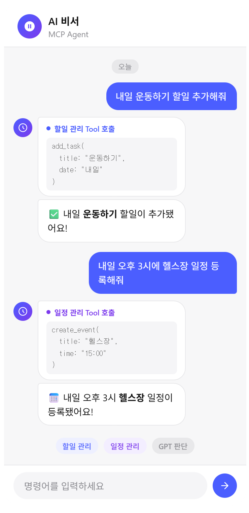

# mcp-assist-orchestrator

> 여러 MCP 서버를 LangGraph 에이전트로 조율하는 개인 비서 프로젝트



---

## 소개

사용자가 자연어로 명령하면 AI 에이전트가 적절한 도구를 선택해서 실행하는 구조입니다.  
할일 관리와 일정 관리 두 가지 MCP 서버를 직접 구현하고, LangGraph 에이전트가 사용자 의도에 맞는 도구를 판단해서 호출합니다.

```
"내일 운동하기 할일 추가해줘"  →  할일 관리 MCP 서버 → add_task 호출
"오후 3시에 헬스장 일정 잡아줘" →  일정 관리 MCP 서버 → create_event 호출
```

---

## 기술 스택

| 분류 | 사용 기술 |
|---|---|
| 언어 | Python 3.13 |
| 패키지 관리 | Poetry |
| AI 프레임워크 | LangGraph, LangChain |
| LLM | OpenAI GPT-4o-mini |
| MCP | FastMCP (mcp SDK) |
| 관측성 | Langfuse |
| 환경 변수 | python-dotenv |

---

## 주요 기능

- **멀티 MCP 서버 오케스트레이션** — 독립 프로세스로 실행되는 MCP 서버 2개를 에이전트가 동시에 조율
- **할일 관리** — 추가, 조회, 완료 처리, 삭제, 키워드 검색
- **일정 관리** — 추가, 날짜별 조회, 삭제
- **Human-in-the-loop** — 삭제 같은 위험한 작업은 실행 전 사용자 승인 요청 (LangGraph interrupt)
- **대화 메모리** — MemorySaver 체크포인터로 이전 대화 맥락 유지
- **관측성** — Langfuse로 LLM 호출, 도구 호출, 토큰 사용량, 응답 시간 추적
- **에러 처리** — LLM 호출 실패 시 재시도 (exponential backoff), 예외 발생 시 graceful fallback
- **무한 루프 방지** — recursion_limit으로 에이전트 루프 횟수 제한

---

## 아키텍처

```
[사용자 자연어 입력]
        ↓
[LangGraph 에이전트]
  ├─ GPT-4o-mini가 요청을 분석하고 적절한 도구 선택
  ├─ 위험한 도구(삭제)는 Human-in-the-loop 승인 게이트 통과
  └─ MemorySaver로 대화 히스토리 유지
        ↓ MCP 프로토콜 (stdio)
  ├─ [task-server]     할일 관리 MCP 서버 → tasks.json
  └─ [calendar-server] 일정 관리 MCP 서버 → events.json
```

---

## 프로젝트 구조

```
mcp-assist-orchestrator/
├── agent/
│   └── main.py              # LangGraph 에이전트 (메인 실행 파일)
├── mcp_servers/
│   ├── task_server.py       # 할일 관리 MCP 서버
│   ├── calendar_server.py   # 일정 관리 MCP 서버
│   ├── tasks.json           # 할일 데이터 (자동 생성)
│   └── events.json          # 일정 데이터 (자동 생성)
├── docs/
│   └── chat-demo.png        # 데모 이미지
├── .env                     # 환경 변수 (직접 생성)
├── .gitignore
├── pyproject.toml
└── poetry.lock
```

---

## 설치 및 실행

### 1. 레포 클론

```bash
git clone https://github.com/rlaskawns888/mcp-assist-orchestrator.git
cd mcp-assist-orchestrator
```

### 2. 패키지 설치

```bash
poetry install
```

### 3. 환경 변수 설정

프로젝트 루트에 `.env` 파일 생성:

```env
OPENAI_API_KEY=sk-...

# Langfuse (선택 — 없어도 실행됨)
LANGFUSE_SECRET_KEY=sk-lf-...
LANGFUSE_PUBLIC_KEY=pk-lf-...
LANGFUSE_HOST=https://cloud.langfuse.com
```

### 4. 실행

```bash
poetry run python3 agent/main.py
```

---

## 사용 예시

```
도구 8개 로드됨: ['add_task', 'list_task', 'complete_task', 'delete_task',
                  'search_task', 'create_event', 'list_events', 'delete_event']
개인 비서 시작 — 종료하려면 'exit' 입력

You: 보고서 작성하기 할일 추가해줘
Agent: "보고서 작성하기" 할일이 추가되었습니다.

You: 내일 오후 3시에 팀 미팅 잡아줘
Agent: 내일 오후 3시에 "팀 미팅" 일정이 등록되었습니다.

You: 보고서 삭제해줘
Agent: 위험한 작업 요청됨: delete_task({'task_id': 1})
       승인하시겠습니까? (yes/no)
You: no
Agent: 작업이 취소되었습니다.

You: exit
종료합니다.
```

---

## 환경 변수

| 변수명 | 필수 | 설명 |
|---|---|---|
| `OPENAI_API_KEY` | ✅ | OpenAI API 키 |
| `LANGFUSE_SECRET_KEY` | ❌ | Langfuse Secret Key (모니터링 사용 시) |
| `LANGFUSE_PUBLIC_KEY` | ❌ | Langfuse Public Key (모니터링 사용 시) |
| `LANGFUSE_HOST` | ❌ | Langfuse 호스트 (기본값: https://cloud.langfuse.com) |

---

## 블로그 회고록

개발 과정에서 겪은 트러블슈팅과 배운 점을 정리했습니다.

👉 [로컬에서 동작하는 개인형 비서 Multi MCP Agent 개발기](https://backlog-dev.tistory.com/137)